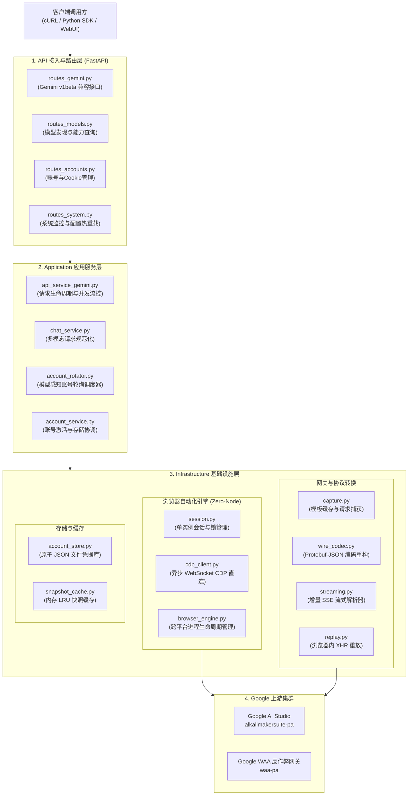
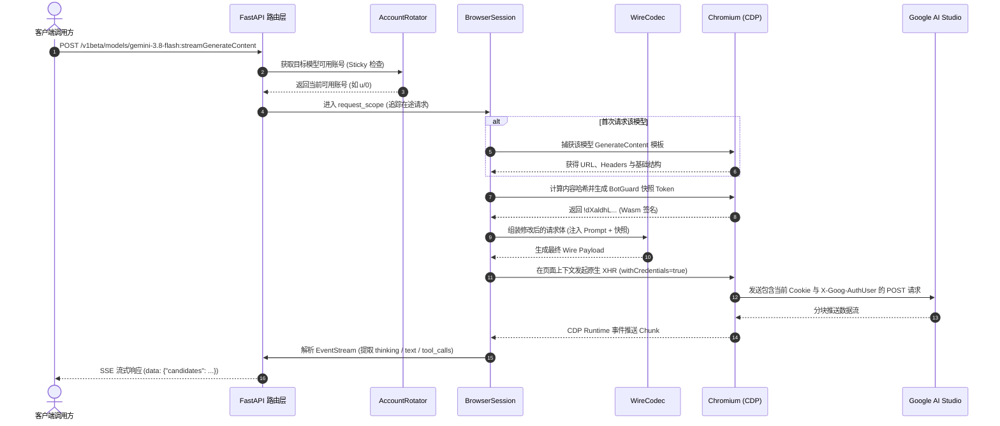

# aistudio-api 系统架构设计文档

本文档详细说明 `aistudio-api` 反向代理服务的整体系统架构、各模块职责分工、数据流转管线以及并发调度与反爬绕过机制。

---

## 1. 整体架构与分层设计

系统采用经典分层架构（Layered Clean Architecture），自上而下分为 **API 接入层**、**Application 应用服务层**、**Domain 领域层** 与 **Infrastructure 基础设施层**：



---

## 2. 核心模块与职责划分

### 2.1 API 接入层 (`src/aistudio_api/api/`)
- **`routes_gemini.py`**：对外暴露符合官方规范的 `/v1beta/models/{model}:generateContent` 和 `:streamGenerateContent` 端点；
- **`routes_models.py`**：动态向 Google 服务端拉取最新可用模型清单（支持 `gemini-3.8-flash`、`gemini-3.7-flash` 等）；
- **`routes_accounts.py`**：提供 Cookie 导入、单份 Cookie 递归多账号探活（`u/0`, `u/1`...）、手动激活切换及删除接口；
- **`dependencies.py`**：统一 API Key 鉴权拦截（支持 `?key=` 参数、`x-goog-api-key`、`x-api-key` 与 `Bearer` Token）。

### 2.2 应用服务层 (`src/aistudio_api/application/`)
- **`chat_service.py`**：将客户端提交的标准 Gemini 请求解析为内部通用格式，处理 Base64 图片解析、系统指令拼装及工具调用配置；
- **`account_rotator.py`**：模型粒度的多账号轮询管理器，支持 `sticky`（默认）、`round_robin`、`lru`、`least_rl` 四种调度模式；
- **`api_service_common.py`**：实现全局单例级防雪崩互斥锁（`_switch_lock`），管理并发 429 故障转移与 RPM/RPD 重试循环。

### 2.3 基础设施层 (`src/aistudio_api/infrastructure/`)
- **浏览器与 CDP 子系统 (`browser/`)**：
  - `cdp_client.py`：纯 Python 异步 WebSocket 实现的原生 Chrome DevTools Protocol 客户端，完全不依赖 Node.js、Playwright 或 Puppeteer；
  - `browser_engine.py`：跨平台 Chromium 探测与受控启动器（内置 Linux、macOS、Windows、Termux `proot` 路径探测与信号树终止逻辑）。
- **网关与编解码子系统 (`gateway/`)**：
  - `wire_codec.py`：负责 Google 内部专有 Protobuf-over-JSON 数组结构（`body[0]` 模型、`body[1]` 会话、`body[3]` 配置、`body[4]` BotGuard 快照）的双向编解码；
  - `stream_parser.py`：增量 JSON 流式解析器，支持从分块原始响应中实时提取 `thinking` 思维链、图片、`tool_calls` 与文本内容。
- **凭据与状态存储 (`account/`)**：
  - `account_store.py`：基于文件系统的原子持久化凭据库（`meta.json` + `auth.json` + `registry.json`），保证并发写入数据安全。

---

## 3. 请求生命周期与执行时序

从客户端发起请求到拿到流式响应的完整流程如下：



---

## 4. 并发控制与高可用设计

### 4.1 资源最小化单进程 Chromium
- 为防止多开浏览器导致内存爆炸（尤其是 1GB RAM 设备），全局仅维持 **单个受控 Chromium 进程**；
- 限制启动参数：`--renderer-process-limit=1`、`--js-flags=--max-old-space-size=128`、`--disable-gpu`；
- 所有并发请求通过 CDP 在页面内部以多路复用 XHR（`XMLHttpRequest`）并发执行，实现极低开销的高吞吐。

### 4.2 模型独立限流与 Sticky 模式
- **模型级配额隔离**：每个账号对 `gemini-3.8-flash`、`gemini-3.7-flash` 等不同模型的 429 状态独立追踪，单模型限流不影响其他模型的可用性；
- **Sticky 策略**：默认优先复用当前激活账号（“逮着一个号薅”），直到该账号对目标模型遭遇 429，才自动切换至下一个可用账号；
- **日配额自动重置**：每日美西时间午夜（00:00 PST）自动重置 RPD 冷却，无需重启服务。

### 4.3 防切号雪崩互斥锁 (`_switch_lock`)
- 当多个并发协程同时遭遇 429 时，率先获得锁的协程执行实质性账号切换；
- 后续获得锁的协程通过双重检查，发现系统账号已切至健康账号，直接复用并重试，**杜绝并发 429 瞬间烧掉多个账号配额的级联切换风暴**。

---

## 5. 跨平台支持与依赖隔离

| 平台 | 运行模式 | 浏览器后端 | 内存基准 |
| :--- | :--- | :--- | :--- |
| **Android (Termux)** | `proot-distro` Linux 容器隔离运行 | CloakBrowser (aarch64) | 常驻约 500MB~650MB (需空闲 RAM ≥ 1GB) |
| **Linux (x86_64 / arm64)** | 原生宿主运行 | 系统 Chrome / Chromium / CloakBrowser | 约 350MB~500MB |
| **macOS (Apple Silicon / Intel)** | 原生宿主运行 | Google Chrome / Chromium / Edge | 约 400MB |
| **Windows (x64)** | 原生宿主运行 | Chrome / Edge (自带 taskkill 安全终止) | 约 450MB |
| **Docker 容器** | Debian 12 基础镜像 | 预装 headless Chromium | 约 400MB |

依赖管理采用环境标记隔离：
```toml
dependencies = [
  "fastapi>=0.115.0",
  "pydantic>=2.0.0",
  "pydantic-core==2.41.5; sys_platform == 'android'",
]
```
在 Android Termux 环境下定向链接 TUR（Termux User Repository）二进制源，而在 Linux/macOS/Windows 下由 PyPI 官方解析原生 wheel，确保全平台一键构建。
