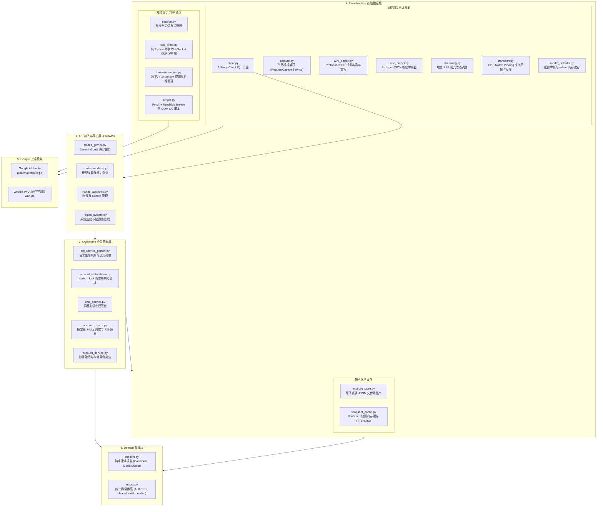
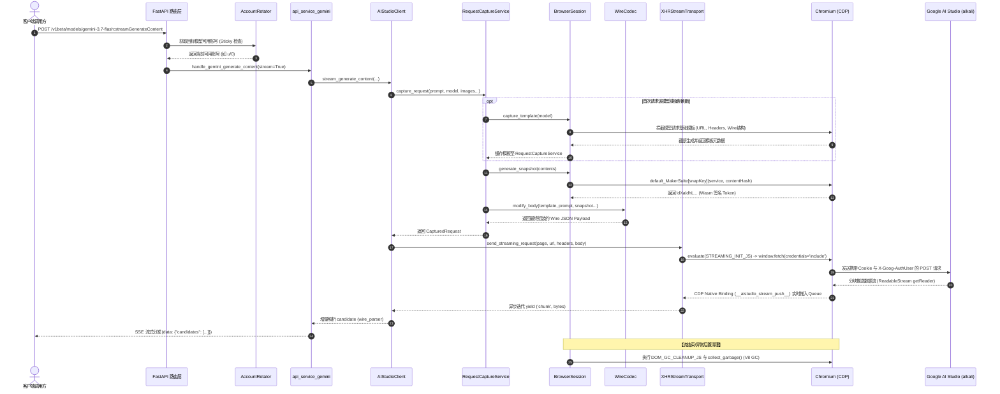

# aistudio-api 系统架构设计

本文档说明 `aistudio-api` 反向代理服务的整体系统架构、各模块职责分工、数据流转管线以及并发调度与反爬绕过机制。

---

## 目录

- [1. 整体架构与分层设计](#1-整体架构与分层设计)
- [2. 核心模块与职责划分](#2-核心模块与职责划分)
- [3. 请求生命周期与执行时序](#3-请求生命周期与执行时序)
- [4. 并发控制与高可用设计](#4-并发控制与高可用设计)
- [5. 跨平台支持与依赖隔离](#5-跨平台支持与依赖隔离)

---

## 1. 整体架构与分层设计

系统采用分层设计（Layered Architecture），划分为 **API 接入层**、**Application 应用服务层**、**Domain 领域层** 与 **Infrastructure 基础设施层**：

---

## 2. 核心模块与职责划分

### 2.1 API 接入层 (`src/aistudio_api/api/`)

| 文件 | 核心职责 |
|---|---|
| `routes_gemini.py` | 对外暴露 `/v1beta/models/{model}:generateContent` 和 `:streamGenerateContent` 端点 |
| `routes_models.py` | 动态向上游拉取并缓存可用模型列表（如 `gemini-3.7-flash`、`gemini-3.8-flash` 等） |
| `routes_accounts.py` | 提供 Cookie 导入、多账号递归探活（`u/0`, `u/1`...）、手动激活与删除接口 |
| `routes_system.py` | 监控指标查询、在线编辑与热重载 `config.yaml` 规则 |
| `dependencies.py` | 统一 API Key 鉴权拦截（支持 Query 参数 `?key=`、Header `x-goog-api-key`、`x-api-key` 或 `Bearer`） |

### 2.2 应用服务层 (`src/aistudio_api/application/`)

| 文件 | 核心职责 |
|---|---|
| `chat_service.py` | 将客户端提交的 Gemini 标准请求转换为内部通用结构，内存处理 Base64 媒体、系统提示与工具参数 |
| `account_rotator.py` | 负责多账号的 Sticky 黏性调度，按模型维护 429 限流与 403 鉴权异常隔离状态，每日美西午夜重置 |
| `account_orchestrator.py` | 提供全局防雪崩互斥锁（`_switch_lock`），在并发 429 与 403 异常时实现安全有序故障转移切号与单账号在位自愈 |
| `account_service.py` | 账号领域用例（Cookie 保存、批量探活导入、凭据激活）封装，杜绝路由层穿透访问存储私有属性 |
| `api_service_gemini.py` | 编排请求全生命周期，协调捕获模板、签名、传输重放及 SSE 流式响应 |

### 2.3 领域模型层 (`src/aistudio_api/domain/`)

| 文件 | 核心职责 |
|---|---|
| `models.py` | 纯净领域数据结构定义（`Candidate`, `ModelOutput`, `GeneratedImage`），杜绝外部协议与 Protobuf 数组下标耦合 |
| `errors.py` | 统一异常体系定义（`SessionExpiredError`, `AuthError`, `UsageLimitExceeded`, `RequestError` 等） |

### 2.4 基础设施层 (`src/aistudio_api/infrastructure/`)

- **浏览器与 CDP 子系统 (`browser/`)**：
  - `cdp_client.py`：基于纯 Python 异步 WebSocket 的 Chrome DevTools Protocol 客户端，支持网络层黑名单拦截与自动清理监听器。
  - `browser_engine.py`：负责 Chromium 跨平台路径探测，启用 `--max-old-space-size=128 --expose-gc` 进行严格内存压降。
  - `scripts.py`：浏览器自动化脚本加载器，将注入脚本从 Python 源码完全剥离至 `js/*.js` 独立管理。
  - `js/`：独立 JavaScript 模块库，包含 `install_hooks.js`（快照挂载）、`streaming_init.js`（Fetch+ReadableStream 绑定推送）、`stream_cleanup.js`、`dialog_cleanup.js`、`dom_gc_cleanup.js` 等，支持静态语法检查与独立维护。
- **网关与编解码子系统 (`gateway/`)**：
  - `client.py`：`AIStudioClient` 网关统一门面，组装会话、模板捕获、快照缓存与流式生成。
  - `transport.py`：纯 CDP 原生 Binding (`__aistudio_stream_push__`) 实时事件驱动流式管道，消除冗余轮询与时间竞争，辅以有界异步队列反压控制与 Python 端 SAPISIDHASH 鉴权注入。
  - `wire_codec.py`：负责 Google 内部 Protobuf-over-JSON 数组结构构造与请求重写。
  - `wire_parser.py`：从领域模型剥离出的纯粹 Protobuf-over-JSON 响应解析器，防范 JSPB `[parts, role]` 结构混淆，将上游分块与使用量转换为领域对象。
  - `capture.py`：集中统一的请求模板单例缓存管理（Single Source of Truth）。
  - `streaming.py`：流式生成编排与异常转换网关。
  - `model_defaults.py`：模型规则解析、工具默认注入及基于文件 mtime 的内存缓存。
- **凭据与存储子系统 (`account/` & `cache/`)**：
  - `account_store.py`：基于文件系统的原子持久化凭据库（紧凑 JSON 格式，避免无效磁盘刷写）。
  - `snapshot_cache.py`：基于 TTL 与 LRU 的 BotGuard 快照内存缓存。
---

## 3. 请求生命周期与执行时序

从客户端请求到获取流式响应的端到端调用时序：

---

## 4. 并发控制与高可用设计

### 4.1 单进程受控 Chromium 架构

- 全局维持 **单个受控 Chromium 进程**，避免多实例多进程导致的内存膨胀。
- 启动限制参数：`--renderer-process-limit=1`、`--js-flags=--max-old-space-size=128 --expose-gc`、`--disable-gpu`。
- 并发请求通过 CDP 客户端在同一个浏览器页面上下文内以轻量 `Fetch + ReadableStream` 执行，并由 `DOM_GC_CLEANUP_JS` 与 V8 原生垃圾回收保持极致内存水位。
### 4.2 模型独立限流、403 鉴权隔离与 Sticky 调度

- **模型级配额隔离**：各账号针对不同模型（如 `gemini-3.7-flash`、`gemini-3.8-flash`）的 429 状态独立记录，单模型额度耗尽不影响其他模型的正常调用。
- **403 鉴权异常快速隔离**：当账号遭遇 `The caller does not have permission` (403) 异常时，调度器立即对该账号设置短时隔离（`auth_cooldown`），优先调度至健康备用账号。
- **Sticky 黏性调度**：默认保持当前活跃账号，直到该账号针对当前模型遭遇 429 限流或 403 异常时，才自动顺延切换至下一个健康账号。
- **自动配额重置**：每日美西时间午夜（00:00 PST / 16:00 CST）自动重置 RPD 限制，无需重启服务。

### 4.3 防切号雪崩互斥锁 (`_switch_lock`) 与自愈

当多个并发协程同时遭遇 429 限流或 403 权限异常时：
1. 率先获得 `_switch_lock` 的协程执行实质性切号与页面上下文刷新；
2. 后续排队获得锁的协程通过双重检查（Double-Checked Locking），识别到账号已被切换至健康账号且对当前模型可用，直接复用重试，避免并发异常导致多次无谓切号；
3. 若为单账号或备用账号全部耗尽时，系统自动对当前账号触发在位强制刷新（In-Place Refresh），彻底清除快照/模板缓存并重新激活会话握手 BotGuard 实现自愈。
---

## 5. 跨平台支持与依赖隔离

| 平台 | 运行模式 | 浏览器后端 | 内存基准 |
|---|---|---|---|
| **Android (Termux)** | `proot-distro` Linux 容器隔离运行 | CloakBrowser (aarch64) | 约 350 - 450 MB PSS（建议空闲 RAM ≥ 1 GB） |
| **Linux (x86_64 / arm64)** | 原生宿主运行 | 系统 Chrome / Chromium / CloakBrowser | 约 250 - 350 MB PSS |
| **macOS (Apple Silicon / Intel)** | 原生宿主运行 | Google Chrome / Chromium / Edge | 约 250 - 350 MB |
| **Windows (x64)** | 原生宿主运行 | Chrome / Edge | 约 280 - 380 MB |
| **Docker 容器** | Debian 基础镜像 | 容器内 headless Chromium | 约 250 - 350 MB |
> 依赖管理推荐使用 `uv`。在 Android Termux 环境下定向适配预编译 wheel，在 Linux/macOS/Windows 下解析官方 wheel，保障全平台构建的一致性与稳定性。
