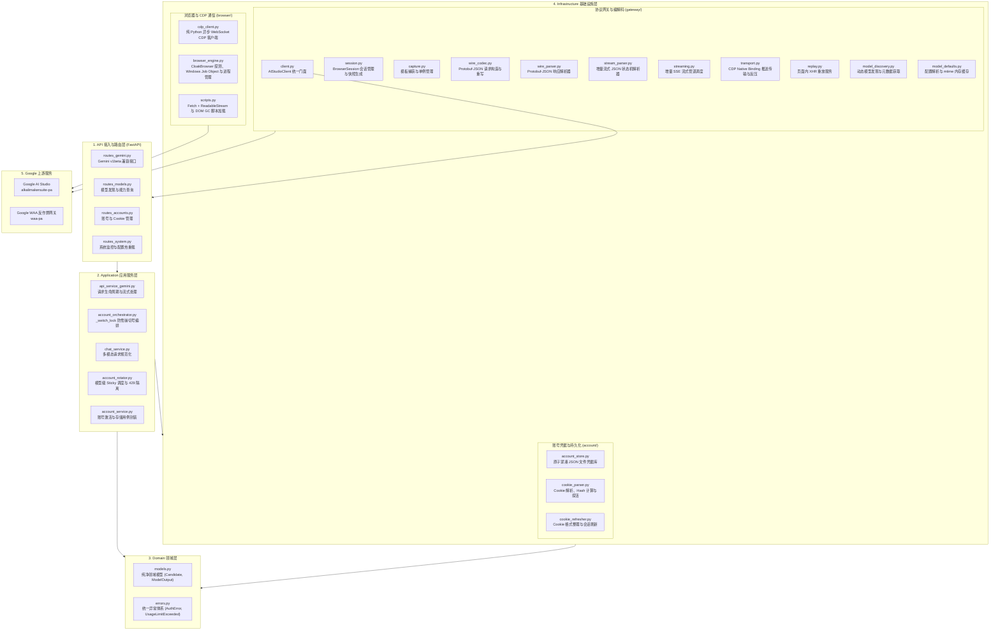
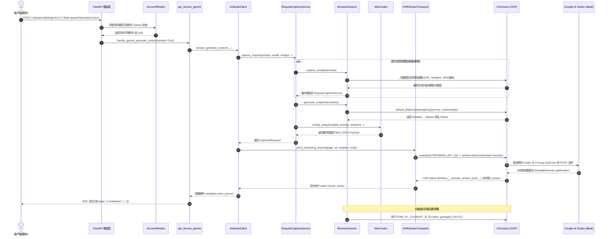

# aistudio-api 系统架构设计

本文档说明 `aistudio-api` 反向代理服务的整体系统架构、各模块职责分工、数据流转管线以及并发调度与反爬绕过机制。

---

## 目录

- [1. 整体架构与分层设计](#1-整体架构与分层设计)
- [2. 核心模块与职责划分](#2-核心模块与职责划分)
- [3. 请求生命周期与执行时序](#3-请求生命周期与执行时序)
- [4. 并发控制与高可用设计](#4-并发控制与高可用设计)
- [5. 跨平台支持与依赖隔离](#5-跨平台支持与依赖隔离)

---

## 1. 整体架构与分层设计

系统采用分层设计（Layered Architecture），划分为 **API 接入层**、**Application 应用服务层**、**Domain 领域层** 与 **Infrastructure 基础设施层**：

```mermaid
flowchart TD
    Client["客户端调用方<br/>(cURL / Python SDK / Web 控制台)"]

    subgraph APILayer ["1. API 接入与路由层 (FastAPI)"]
        RoutesGemini["routes_gemini.py<br/>Gemini v1beta 兼容接口"]
        RoutesModels["routes_models.py<br/>模型发现与能力查询"]
        RoutesAccounts["routes_accounts.py<br/>账号与 Cookie 管理"]
        RoutesSystem["routes_system.py<br/>系统监控与配置热重载"]
    end

    subgraph AppLayer ["2. Application 应用服务层"]
        APISvc["api_service_gemini.py<br/>请求生命周期与流式处理"]
        Orchestrator["account_orchestrator.py<br/>_switch_lock 防雪崩切号编排"]
        ChatSvc["chat_service.py<br/>多模态请求规范化"]
        AccountRotator["account_rotator.py<br/>模型级 Sticky 调度与 429 隔离"]
        AccountSvc["account_service.py<br/>账号激活与存储用例封装"]
    end

    subgraph DomainLayer ["3. Domain 领域层"]
        Models["models.py<br/>纯净领域模型 (Candidate, ModelOutput)"]
        Errors["errors.py<br/>统一异常体系 (AuthError, UsageLimitExceeded)"]
    end

    subgraph InfraLayer ["4. Infrastructure 基础设施层"]
        subgraph GatewaySub ["协议网关与编解码 (gateway/)"]
            Client["client.py<br/>AIStudioClient 统一门面"]
            Session["session.py<br/>BrowserSession 会话管理与快照生成"]
            CaptureSvc["capture.py<br/>模板捕获与单例管理"]
            WireCodec["wire_codec.py<br/>Protobuf-JSON 请求构造与重写"]
            WireParser["wire_parser.py<br/>Protobuf-JSON 响应解析器"]
            StreamParser["stream_parser.py<br/>增量流式 JSON 状态机解析器"]
            StreamingGateway["streaming.py<br/>增量 SSE 流式管道调度"]
            Transport["transport.py<br/>CDP Native Binding 推送传输与反压"]
            ReplaySvc["replay.py<br/>页面内 XHR 重放服务"]
            ModelDisc["model_discovery.py<br/>动态模型发现与元数据获取"]
            ModelDefaults["model_defaults.py<br/>配置解析与 mtime 内存缓存"]
        end
        subgraph BrowserSub ["浏览器与 CDP 通信 (browser/)"]
            CDPClient["cdp_client.py<br/>纯 Python 异步 WebSocket CDP 客户端"]
            BrowserEngine["browser_engine.py<br/>CloakBrowser 探测、Windows Job Object 与进程管理"]
            Scripts["scripts.py<br/>Fetch + ReadableStream 与 DOM GC 脚本加载"]
        end
        subgraph AccountSub ["账号凭据与持久化 (account/)"]
            AccountStore["account_store.py<br/>原子紧凑 JSON 文件凭据库"]
            CookieParser["cookie_parser.py<br/>Cookie 解析、Hash 计算与探活"]
            CookieRefresher["cookie_refresher.py<br/>Cookie 格式整理与会话刷新"]
        end
    end

    subgraph Upstream ["5. Google 上游服务"]
        AIStudio["Google AI Studio<br/>alkalimakersuite-pa"]
        Waa["Google WAA 反作弊网关<br/>waa-pa"]
    end

    Client --> APILayer
    APILayer --> AppLayer
    AppLayer --> DomainLayer
    AppLayer --> InfraLayer
    InfraLayer --> DomainLayer
    BrowserSub --> Upstream
    GatewaySub --> Upstream
```
---

## 2. 核心模块与职责划分

### 2.1 API 接入层 (`src/aistudio_api/api/`)

| 文件 | 核心职责 |
|---|---|
| `routes_gemini.py` | 对外暴露 `/v1beta/models/{model}:generateContent` 和 `:streamGenerateContent` 端点 |
| `routes_models.py` | 动态向上游拉取并缓存可用模型列表（如 `gemini-3.7-flash`、`gemini-3.8-flash` 等） |
| `routes_accounts.py` | 提供 Cookie 单条/Bundle文件导入、多账号递归探活（`u/0`, `u/1`...）、手动激活与删除接口 |
| `routes_system.py` | 监控指标查询、在线编辑与热重载 `config.yaml` 规则 |
| `dependencies.py` | 统一 API Key 鉴权拦截（支持 Query 参数 `?key=`、Header `x-goog-api-key`、`x-api-key` 或 `Bearer`） |

### 2.2 应用服务层 (`src/aistudio_api/application/`)

| 文件 | 核心职责 |
|---|---|
| `chat_service.py` | 将客户端提交的 Gemini 请求转换为内部结构，处理 Base64 媒体、系统提示与工具参数声明 |
| `account_rotator.py` | 负责多账号的 Sticky 黏性调度，按模型维护 429 限流与 403 鉴权异常隔离状态，每日美西午夜重置 |
| `account_orchestrator.py` | 提供全局防雪崩互斥锁（`_switch_lock`），在并发 429 与 403 异常时实现安全有序故障转移切号与单账号在位自愈 |
| `account_service.py` | 账号领域用例（Cookie 保存、批量探活导入、凭据激活）封装，杜绝路由层穿透访问存储私有属性 |
| `api_service_gemini.py` | 编排请求全生命周期，协调捕获模板、签名、传输重放及 SSE 流式响应 |

### 2.3 领域模型层 (`src/aistudio_api/domain/`)

| 文件 | 核心职责 |
|---|---|
| `models.py` | 纯净领域数据结构定义（`Candidate`, `ModelOutput`, `GeneratedImage`），杜绝外部协议与 Protobuf 数组下标耦合 |
| `errors.py` | 统一异常体系定义（`SessionExpiredError`, `AuthError`, `UsageLimitExceeded`, `RequestError` 等） |

### 2.4 基础设施层 (`src/aistudio_api/infrastructure/`)

- **浏览器与 CDP 子系统 (`browser/`)**：
  - `cdp_client.py`：Chrome DevTools Protocol 异步客户端，负责 WebSocket 协议通信、网络过滤与目标管理。
  - `browser_engine.py`：Chromium 路径探测、参数组装与进程/端口生命周期管理（支持 Win32 API 与 Linux 容器环境）。
  - `scripts.py`：浏览器端注入脚本加载器。
  - `js/`：浏览器端独立脚本，包含 Hook 注入、流式通信、快照签名与内存清理。
- **网关与编解码子系统 (`gateway/`)**：
  - `client.py`：`AIStudioClient` 统一门面，组装请求重放、流式生成与会话生命周期。
  - `session.py`：`BrowserSession` 会话管理器，负责页面导航、WAA 运行时保持及实时快照生成。
  - `wire_spec.py`：Protobuf-over-JSON (JSPB) 字段索引枚举与 `JspbArray` 稀疏容器定义。
  - `wire_codec.py`：JSPB 请求结构组包与参数改写。
  - `wire_parser.py`：JSPB 响应解析器，处理 Struct 结构体、ListValue 数组与状态码映射。
  - `stream_parser.py`：流式 JSON 增量状态机解析器，去除 XSSI 前缀并按深度解析数据分块。
  - `transport.py`：基于 CDP Binding 的事件推送管道，支持队列反压控制与时间戳签名注入。
  - `capture.py`：请求模板缓存与模型适配。
  - `replay.py`：页面上下文 XHR 请求重放与异常降级。
  - `streaming.py`：流式响应分发与异常映射。
  - `model_discovery.py`：可用模型列表动态探测与本地降级。
  - `model_defaults.py`：模型默认规则解析与缓存。
- **账号与持久化子系统 (`account/`)**：
  - `account_store.py`：账号凭据持久化存储（通过临时文件原子替换保障并发安全）。
  - `cookie_parser.py`：Cookie 格式解析、SAPISIDHASH 计算与多子账号探测。
  - `cookie_refresher.py`：Cookie 凭据规整与会话保活刷新。

## 3. 请求生命周期与执行时序

从客户端请求到获取流式响应的端到端调用时序：

```mermaid
sequenceDiagram
    autonumber
    actor Client as 客户端调用方
    participant API as FastAPI 路由层
    participant Rotator as AccountRotator
    participant APISvc as api_service_gemini
    participant Facade as AIStudioClient
    participant Capture as RequestCaptureService
    participant Session as BrowserSession
    participant Codec as WireCodec
    participant Transport as XHRStreamTransport
    participant Page as Chromium (CDP)
    participant Google as Google AI Studio (alkali)

    Client->>API: POST /v1beta/models/gemini-3.7-flash:streamGenerateContent
    API->>Rotator: 获取目标模型可用账号 (Sticky 检查)
    Rotator-->>API: 返回当前可用账号 (如 u/0)
    API->>APISvc: handle_gemini_generate_content(stream=True)
    APISvc->>Facade: stream_generate_content(...)
    
    Facade->>Capture: capture_request(prompt, model, images...)
    opt 首次请求该模型或强制刷新
        Capture->>Session: capture_template(model)
        Session->>Page: 拦截模型请求基础模板 (URL, Headers, Wire结构)
        Page-->>Session: 截断生成并返回模板元数据
        Session-->>Capture: 缓存模板至 RequestCaptureService
    end

    Capture->>Session: generate_snapshot(contents)
    Session->>Page: default_MakerSuite[snapKey](service, contentHash)
    Page-->>Session: 返回 !dXaldhL... (Wasm 签名 Token)
    Capture->>Codec: modify_body(template, prompt, snapshot...)
    Codec-->>Capture: 返回最终组装的 Wire JSON Payload
    Capture-->>Facade: 返回 CapturedRequest

    Facade->>Transport: send_streaming_request(page, url, headers, body)
    Transport->>Page: evaluate(STREAMING_INIT_JS) -> window.fetch(credentials='include')
    Page->>Google: 发送携带 Cookie 与 X-Goog-AuthUser 的 POST 请求
    Google-->>Page: 分块推送数据流 (ReadableStream getReader)
    Page-->>Transport: CDP Native Binding (__aistudio_stream_push__) 实时推入 Queue
    Transport-->>Facade: 异步迭代 yield ('chunk', bytes)
    Facade-->>APISvc: 增量解析 candidate (wire_parser)
    APISvc-->>Client: SSE 流式分发 (data: {"candidates": [...]})
    
    Note over Session,Page: 【流结束/异常后置清理】
    Session->>Page: 执行 DOM_GC_CLEANUP_JS 与 collect_garbage() (V8 GC)
```
---

## 4. 并发控制与高可用设计

### 4.1 单进程受控 Chromium 架构

- 全局维持 **单个受控 Chromium 进程**，避免多实例多进程导致的内存膨胀。
- 启动限制参数：`--renderer-process-limit=1`、`--js-flags=--max-old-space-size=128 --expose-gc`、`--disable-gpu`。
- 并发请求通过 CDP 客户端在同一个浏览器页面上下文内以轻量 `Fetch + ReadableStream` 执行，并由 `DOM_GC_CLEANUP_JS` 与 V8 原生垃圾回收控制内存占用。

### 4.2 模型独立限流、403 鉴权隔离与 Sticky 调度

- **模型级配额隔离**：各账号针对不同模型（如 `gemini-3.7-flash`、`gemini-3.8-flash`）的 429 状态独立记录，单模型额度耗尽不影响其他模型的正常调用。
- **403 鉴权异常快速隔离**：当账号遭遇 `The caller does not have permission` (403) 异常时，调度器立即对该账号设置短时隔离（`auth_cooldown`），优先调度至健康备用账号。
- **Sticky 黏性调度**：默认保持当前活跃账号，直到该账号针对当前模型遭遇 429 限流或 403 异常时，才自动顺延切换至下一个健康账号。
- **自动配额重置**：每日美西时间午夜（00:00 PST / 16:00 CST）自动重置 RPD 限制，无需重启服务。

### 4.3 防切号雪崩互斥锁 (`_switch_lock`) 与自愈

当多个并发协程同时遭遇 429 限流或 403 权限异常时：
1. 率先获得 `_switch_lock` 的协程执行实质性切号与页面上下文刷新；
2. 后续排队获得锁的协程通过双重检查（Double-Checked Locking），识别到账号已被切换至健康账号且对当前模型可用，直接复用重试，避免并发异常导致多次无谓切号；
3. 若为单账号或备用账号全部耗尽时，系统自动对当前账号触发在位强制刷新（In-Place Refresh），清除模板缓存并重新激活会话握手 BotGuard 实现自愈。

## 5. 跨平台支持与依赖隔离

| 平台 | 运行模式 | 浏览器后端 | 内存基准 |
|---|---|---|---|
| **Android (Termux)** | `proot-distro` Linux 容器隔离运行 | CloakBrowser (aarch64) | 约 350 - 450 MB PSS（建议空闲 RAM ≥ 1 GB） |
| **Linux (x86_64 / arm64)** | 原生宿主运行 | CloakBrowser (x86_64 / arm64) | 约 250 - 350 MB PSS |
| **macOS (Apple Silicon / Intel)** | 原生宿主运行 | CloakBrowser | 约 250 - 350 MB |
| **Windows (x64)** | 原生宿主运行 (Job Object 进程管理) | CloakBrowser (x64) | 约 280 - 380 MB |
| **Docker 容器** | Debian 基础镜像 | 容器内 CloakBrowser | 约 250 - 350 MB |
> 依赖管理使用 `uv`。由于 PyPI 官方未提供 Android 预编译 wheel，而 Termux 的 TUR 源缺少桌面端 wheel，因此 `uv.lock` 不纳入版本控制：桌面端直接从 PyPI 安装对应 wheel；Termux 环境通过本地 `uv.toml` 使用 TUR 源，避免不同平台的 wheel 源锁定冲突。
